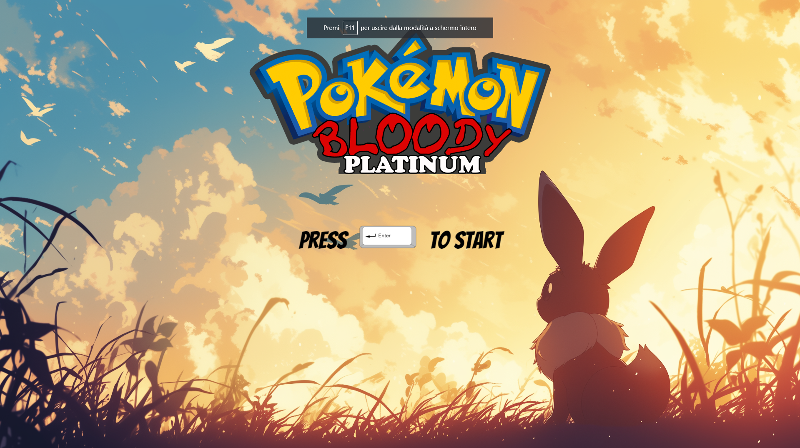
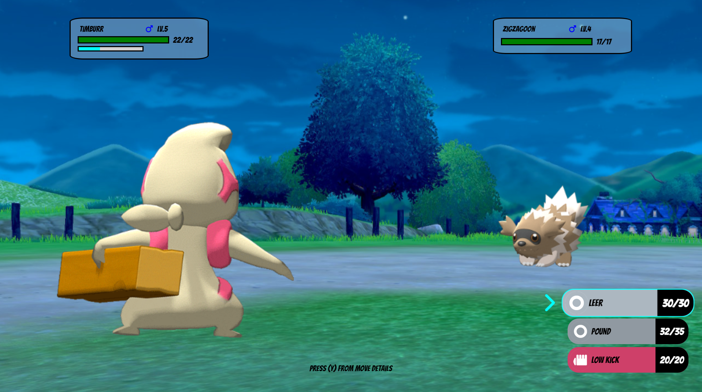

# Pokemon Bloody Red

## Screenshots




## Introduction

Hello everyone, I'm Alessandro, and this is my first game development project: Pokemon Bloody Red. The project is still in a very early phase, and I plan to keep working and updating this constantly for a very long time, so feel free to reach out for any ideas, recommendations, bug reports (won't be hard to find one), or questions. So far, the game only consists of a few maps and one final boss: Duke Rayneera. If you manage to defeat her, congratulations! You're the first one to ever complete the game (creator included, rip).

## How to Play

### Play Online

You can play the game online by visiting the deploy link over Netlify: [Pokemon Bloody Red](https://pokemon-bloody-red.netlify.app/).

### Play Locally

To play the game locally, follow these steps:

1. **Clone the Repository**: Clone the project repository from GitHub to your local machine. Open your terminal and run the following command:

  ```bash
git clone https://github.com/AlessandroCampo/Pokemon-Vue-Phaser.git
```


2. **Navigate to the Project Directory**: Change your current directory to the cloned project directory:

```bash
npm install
```

3. **Start the game**: Once the dependencies are installed, you can start the game by running:
npm start
then open your web browser and navigate to the suggested localhost

### Controls
Use arrow keys to move the character and navigate the menus.
Use the Enter key to confirm menu choices or interact with other characters or game objects.
Use the backspace key to quit current menus or open the main menu in the world scene.


## Plot

In this fantasy world, pokemons are used as creatures to fight wars and politically control lands; therefore, it's illegal to own them and train them, as it's considered subversive behavior towards the regime. Therefore, as the main character, you will be engaged in battles by each guard you meet. Unlike regular pokemon games, if a pokemon faints in battle, it's considered dead and will not be available again. If all of your pokemons die, the window will instantly reload, and you will be back to the previous save point.

## Game Documentation

At the start of the game, you will be given 200 Mega Balls and Rare Candies to speed up the farming process after choosing your starter.

There is currently one boss fight in the game: Rayneera. Her team consists of:

- **Lunatone**, moves: [Moonlight, Confusion, Rock Slide, Hypnosis]
- **Nosepass**, moves: [Self Destruct, Seismic Toss, Thunder Wave, Rock Throw]
- **Lileep**, moves: [Giga Drain, Sludge Bomb, Recover, Rock Tomb]

All of Reyneera's pokemons hold a Sitrus Berry and are set at level 15. You're not allowed to own more than 1 pokemon over the size of the next boss' team, and you can't overlevel it. Therefore, for boss number one, the cap is level 15 and 4 pokemons owned.

All other regular trainers will have a team of random pokemons (among the encounterable ones) with random moves, equal to the length of your team.

Right now, you can encounter the following pokemons on the map: Zigzagoon, Electrike, Ralts, Starly, Meowth, Wingull, Poochyena.

## Credits

I want to thank all of the artists I got the game assets from browsing online (will list all of them) and Scott Westover for the amazing educational content for Phaser3, where I got a lot of knowledge to start working on my first Phaser project.

Tutorial playlist: [Phaser 3 Tutorial Playlist](https://www.youtube.com/playlist?list=PLmcXe0-sfoSgq-pyXrFx0GZjHbvoVUW8t)

