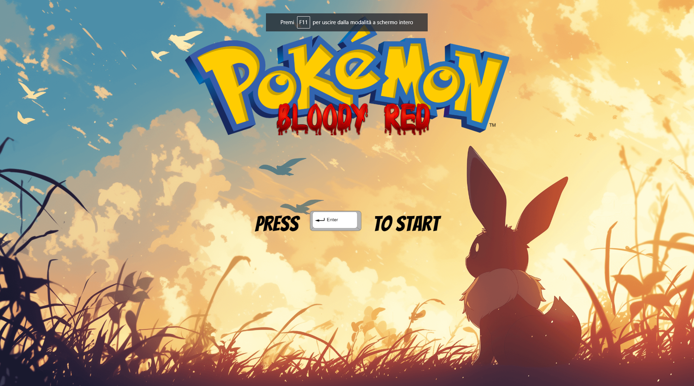

# Pokemon Bloody Red

## Screenshots




## Introduction

Hello everyone, I'm Alessandro, and this is my first game development project: Pokemon Bloody Red. The project is still in a very early phase, and I plan to keep working and updating this constantly for a very long time, so feel free to reach out for any ideas, recommendations, bug reports (won't be hard to find one), or questions. So far, the game only consists of a few maps and 4 boss fights: Archie, Rayneera, Erika and Maxie.

 If you manage to defeat all of them, congratulations! You're the first one to ever complete the game (creator included, rip).

## How to Play

### Play Online

You can play the game online by visiting the deploy link over Netlify: [Pokemon Bloody Red](https://pokemon-bloody-red.netlify.app/).

### Play Locally

To play the game locally, follow these steps:

1. **Clone the Repository**: Clone the project repository from GitHub to your local machine. Open your terminal and run the following command:

  ```bash
git clone https://github.com/AlessandroCampo/Pokemon-Vue-Phaser.git
```


2. **Navigate to the Project Directory**: Change your current directory to the cloned project directory:

```bash
npm install
```

3. **Start the game**: Once the dependencies are installed, you can start the game by running:
```bash
npm run dev
```
then open your web browser and navigate to the suggested localhost

### Controls
Use arrow keys to move the character and navigate the menus.
Use the Enter key to confirm menu choices or interact with other characters or game objects.
Use the backspace key to quit current menus or open the main menu in the world scene.

### Level Difficulty

In order to make the game more challenging, some "rules" are different compered to standard pokèmon games.

1. **Hardcore Mode**:
    In hardcore mode, you can only catch one pokèmon per species, and if it faitns during battle it's considered dead and won't be available anymore. You're not allowed to use any items in battle, and you can't overlevel the next lord fight (So you're restricted to lv15 before beating Rayneera and 20 after).
    Ah almost forgot, your starters are shit.

2. **Medium Mode**
    I don't know why I called this "medium", it's still really hard. Compered to the hard mode you're at least allowed to use items during battle and you have the standard Hoenn starters. Doens't seem much, but it makes a huge difference trust me.

2. **Easy Mode**
    This mode is if you want to enjoy the game a bit more casually, you're allowed to catch more than one pokèmon per type and you don't lose them after KO. Also you're allowed to level up to 16 at the start of the game, which allows you to evolve some pokèmons earlier than other game modes, namely your starter.


## Plot

In this fantasy world, pokemons are used as creatures to fight wars and politically control lands; therefore, it's illegal to own them and train them, as it's considered subversive behavior towards the regime. Therefore, as the main character, you will be engaged in battles by each guard you meet. Your goal is to defeated the 4 lords (villain gym leaders).
Lose one single battle and you're considered dead, and the window will automatically refresh (Compulsive saving highly recommended!).

## Game Documentation

At the start of the game, you will be given 200 Mega Balls and Rare Candies to speed up the farming process after choosing your starter.

You can find detailed informations about the possible encounter and the main fights here:

[Game Documentation](https://docs.google.com/document/d/10Z8nHdHQ3kvlFF5s2Wtgr9wolXKhQmJUD1l8wibRkoc/edit)

## Credits

I want to thank all of the artists I got the game assets from browsing online and Scott Westover for the amazing educational content for Phaser3, where I got a lot of knowledge to start working on my first Phaser project.

Character sprites by [Aveontrainer](https://www.deviantart.com/aveontrainer)
Maps by [Phyromatical](https://www.deviantart.com/phyromatical)
Battle Backgrounds by [PoenixOfLight92](https://www.deviantart.com/phoenixoflight92)

Tutorial playlist: [Phaser 3 Tutorial Playlist](https://www.youtube.com/playlist?list=PLmcXe0-sfoSgq-pyXrFx0GZjHbvoVUW8t)

